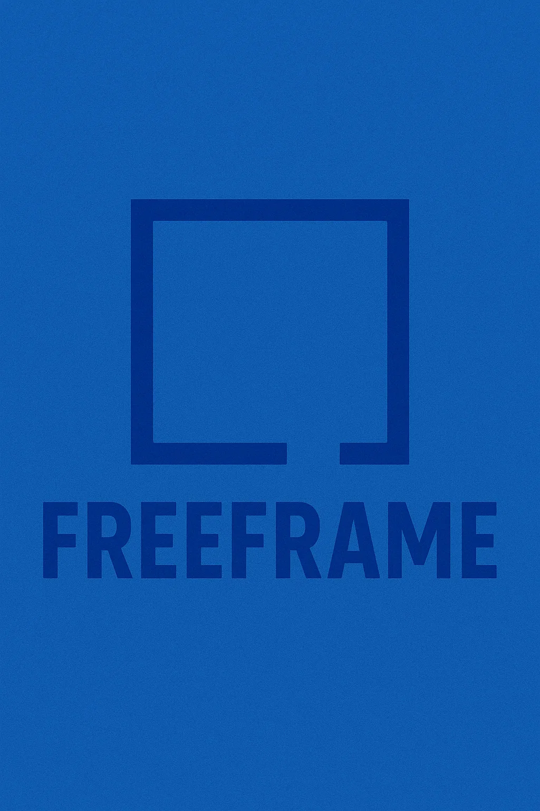
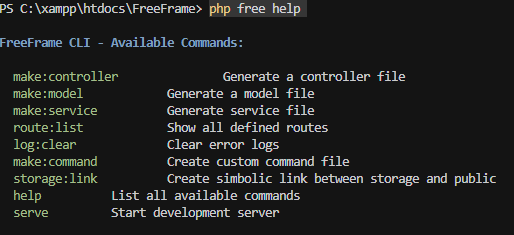

# FreeFrame – A Lightweight PHP Framework



FreeFrame is a lightweight, modular PHP framework inspired by Laravel and CakePHP, built for rapid development with minimal setup. It comes with its own powerful CLI tool named `free`, allowing you to scaffold components, manage your project structure, and streamline development.

---

### 🚀 Features

- Custom CLI tool – free lets you create controllers, models, and run other useful commands.

- Easy to use – Designed to be lightweight and modular, FreeFrame is perfect for building your own web applications.

- Automatic routing – Route your requests easily to the correct controllers and methods.

- Environment handling – Use .env files for configuration, making it easy to manage different environments.

---

### System Compatibility
- PHP 8.0
- Composer 2.0
- Apache (XAMPP, LAMP)
- PDO Driver
- MongoDB driver

### 🧱 Framework Structure
```text
my-app/
├── App/
│   ├── Controllers/
|   |── Middlewares/ 
│   ├── Models/
│   ├── Services/
│   └── Helpers/
├── config/
├── core/
|   ├── bootstrap.php
|   |── Router.php
├── public/
│   └── index.php
├── resources/
│   ├── pages/
│   └── assets/
├── routes/
│   └── route.php
├── storage/
│   ├── Logs/
|   ├── Public/
│   └── Cache/
|   
├── .env
├── .env.example
├── free
├── Execute.sh
├── composer.json
└── README.md
```

### Implemented Features
```text
✔ CLI (php free)

✔ Routing system (routes/route.php)

✔ Controllers (make:controller)

✔ Services (make:service)

✔ Models (make:model)

✔ Middleware (make:middleware)

✔ Logging system (error.log)

✔ log:clear and storage:link commands

✔ Route listing (route:list)

✔ Auto exception logging

✔ Basic MySQL & MongoDB integration setup

✔ Custom command generator (make:command)

✔ Debugger placeholder

✔ CLI server (php free serve)
```

### 🏚️ Namespace or Class not found issue resolved
```sh
$ composer dump-autoload
```
### Publish Framework
- Tag latest commit with a semantic version:
```sh
$ git tag v1.0.0
$ git push origin v1.0.0
```
- Submit Framework repo at Packagist
https://packagist.org/packages, then click on `Update`

- Create a blnak project `$ composer create-project freeframe/freeframe my-app ^2.5`
- Specify version `$ composer create-project freeframe/freeframe my-app "2.5"`
- Alter try `$ composer create-project freeframe/freeframe my-app --stability=dev`

### ✅ Install Symfony Console via Composer
1. Install
```sh
$ composer require symfony/console
```
2. Create CLI Entry File
```text
framework/
    ├── ignite_file        ← this is CLI
    ├── composer.json
    ├── vendor/
```

### 🗂️ Create a Project
```sh
$ composer create-project freeframe/freeframe my-app --stability=dev
```

###  Start Server
```sh
$ php free serve
```
> Open `http://localhost:8000/`

### List of Commands
> Check version
```sh
$ php free --version
```
```sh
FreeFrame CLI v1.0.0
```
###  Create Controller
```sh
$ php free make:controller HomeController
```
> `App\Controllers\New-Controller`

### Create Service Classes under App/Services
```sh
$ php free make:service UserService
```
### Create Model
```sh
$ php free make:model User
```
> Created at `App/Models` folder

### Clear Error logs
```sh
$ php free log:clear
```
### Create Storage link in public
```sh
$ php free storage:link
```
### See Available commands
```sh
$ php free help
```


### List of Routes
```sh
$ php free route:list
```

### Create Middleware
```sh
$ php free make:middleware AuthMiddleware
```

### Connect database (Default Support `Mysql` & `MongoDB`)
> At Controller or Service Layer
```php
use Core\Database;

$db = (new Database())->getConnection();

// Example RDB query
if ($db instanceof PDO) {
    $stmt = $db->query("SELECT * FROM users");
    $users = $stmt->fetchAll(PDO::FETCH_ASSOC);
}

// Example MongoDB query:
if ($db instanceof \MongoDB\Database) {
    $collection = $db->users;
    $users = $collection->find()->toArray();
}
```
> Install Mongodb extension
> Download extension for Windows from here according to PHP version: [Click](https://pecl.php.net/package/mongodb/2.0.0/windows)
> Check thread safety or not 
```sh
$ php -i > phpinfo.txt 
```
> Search `Thread Safety`, 💡 If Thread Safety is enabled, you need the TS version of the MongoDB DLL.
If it's disabled, download the NTS version.
> Place the downloaded .dll into: `C:\xampp\php\ext`
> Open your php.ini file `(in C:\xampp\php)` and add: `extension=mongodb`
> Restart Apache using the XAMPP control panel.
```sh
extension=php_mongodb.dll
```
### Migrate Tables from RDB
```sh
$ php free migrate
```

### Create Custom Request
```sh
$ php free make:request CommonRequest
```
```php
use Core\Http\Request;
use Core\Http\Response;
use App\Requests\CommonRequest;

public function store()
{
    $request = new Request();
    $userRequest = new UserRequest();

    if (!$userRequest->validate($request->all())) {
        return Response::json(['errors' => $userRequest->errors()], 422)->send();
    }

    // Proceed with storing user...

    return Response::json(['message' => 'User created successfully']);
}
```

### Auth Scaffolding feature (JWT Authentication)
```sh
$ php free auth:install
```
> `AuthController`, `AuthMiddleware` will created `JWT secret` will append in `.env`

### ORM Relationships
```php
use App\Models\Profile;
use App\Models\Post;
use App\Models\User;

public function profileDetails()
{
    return $this->hasOnlyOne(Profile::class, 'user_id');
}

public function posts()
{
    return $this->hasManyMore(Post::class, 'user_id');
}

public function author()
{
    return $this->belongsToOnly(User::class, 'user_id');
}

```

### Create Routes
> At routes/route.php
```php
use App\Controllers\HomeController;

$router->get('/', 'HomeController@index');
```
> Define Routes with Prefixes
```php
$router->group(['prefix' => '/api'], function ($router) {
    $router->get('/users', 'UserController@index');
    $router->post('/login', 'AuthController@login');
});

$router->group(['prefix' => '/admin'], function ($router) {
    $router->get('/dashboard', 'AdminController@dashboard');
    $router->post('/settings', 'AdminController@saveSettings');
});
```
This will shown as
```text
/api/users

/api/login

/admin/dashboard

/admin/settings
```

### 👏 Credit
Built with ❤️ by **[Sagnik Dey](https://github.com/sagnikrivud)**


I'm a self-taught programmer and I'm open to any kind of feedback/suggestions. This framework is a hobby project and I'm doing it in my free time. If you find any bug or something that you think should be improved please open an issue or make a pull request.

I'm also a big fan of the Laravel framework, and I've been inspired by it, so if you see something that looks like Laravel, is because I like how they do things. But, I'm not trying to copy them, I'm just trying to do something similar but with my own style.


💻 Tech Stack


                     
         
