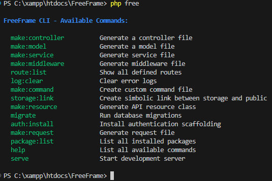

# FreeFrame – A Lightweight PHP Framework


FreeFrame is a lightweight, modular PHP framework inspired by Laravel and CakePHP, built for rapid development with minimal setup. It comes with its own powerful CLI tool named `free`, allowing you to scaffold components, manage your project structure, and streamline development.

---

### 🚀 Features

- Custom CLI tool – free lets you create controllers, models, and run other useful commands.

- Easy to use – Designed to be lightweight and modular, FreeFrame is perfect for building your own web applications.

- Automatic routing – Route your requests easily to the correct controllers and methods.

- Environment handling – Use .env files for configuration, making it easy to manage different environments.

---

### System Compatibility
- PHP 8.0
- Composer 2.0
- Apache (XAMPP, LAMP)
- PDO Driver
- MongoDB driver

### 🧱 Framework Structure
```text
my-app/
├── App/
│   ├── Controllers/
|   |── Middlewares/ 
│   ├── Models/
│   ├── Services/
│   └── Helpers/
├── config/
├── core/
|   ├── bootstrap.php
|   |── Router.php
├── public/
│   └── index.php
├── resources/
│   ├── pages/
│   └── assets/
├── routes/
│   └── route.php
├── storage/
│   ├── Logs/
|   ├── Public/
│   └── Cache/
|   
├── .env
├── .env.example
├── free
├── Execute.sh
├── composer.json
└── README.md
```

### 🏚️ Namespace or Class not found issue resolved
```sh
$ composer dump-autoload
```
### Publish Framework
- Tag latest commit with a semantic version:
```sh
$ git tag v1.0.0
$ git push origin v1.0.0
```
- Submit Framework repo at Packagist
https://packagist.org/packages, then click on `Update`

- Create a blnak project `$ composer create-project freeframe/freeframe my-app`
- Alter try `$ composer create-project freeframe/freeframe my-app --stability=dev`

### ✅ Install Symfony Console via Composer
1. Install
```sh
$ composer require symfony/console
```
2. Create CLI Entry File
```text
framework/
    ├── ignite_file        ← this is CLI
    ├── composer.json
    ├── vendor/
```

### 🗂️ Create a Project
```sh
$ composer create-project freeframe/freeframe my-app --stability=dev
```

###  Start Server
```sh
$ php free serve
```
> Open `http://localhost:8000/`

### List of Commands
> Check version
```sh
$ php free --version
```
```sh
FreeFrame CLI v1.0.0
```
###  Create Controller
```sh
$ php free make:controller HomeController
```
> `App\Controllers\New-Controller`

### Create Service Classes under App/Services
```sh
$ php free make:service UserService
```
### Create Model
```sh
$ php free make:model User
```
> Created at `App/Models` folder

### Clear Error logs
```sh
$ php free log:clear
```
### Create Storage link in public
```sh
$ php free storage:link
```
### See Available commands
```sh
$ php free help
```


### List of Routes
```sh
$ php free route:list
```

### Connect database (Default Support `Mysql` & `MongoDB`)
> At Controller or Service Layer
```php
use Core\Database;

$db = (new Database())->getConnection();

// Example RDB query
if ($db instanceof PDO) {
    $stmt = $db->query("SELECT * FROM users");
    $users = $stmt->fetchAll(PDO::FETCH_ASSOC);
}

// Example MongoDB query:
if ($db instanceof \MongoDB\Database) {
    $collection = $db->users;
    $users = $collection->find()->toArray();
}
```
> Install Mongodb extension
```sh
extension=php_mongodb.dll
```
### Migrate Tables from RDB
```sh
$ php free migrate
```

### Create Routes
> At routes/route.php
```php
use App\Controllers\HomeController;

$router->get('/', 'HomeController@index');
```

### 👏 Credit
Built with ❤️ by **[Sagnik Dey](https://github.com/sagnikrivud)**

💻 Tech Stack


                     
         
